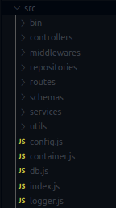

<h1 align="center">Node Starter App</h1>
<p>
  
  <a href="https://github.com/ebukaume/node-starter-app#readme" target="_blank">
    
  </a>
  <a href="https://github.com/ebukaume/node-starter-app/commit-activity" target="_blank">
    
  </a>
</p>

<br>

This is a framework for easily setting up a node app (API specifically). Dependecies are mostly injected into an IoC container ([Awilix](https://www.npmjs.com/package/awilix) in this case). It tries to enforce reuseability, separation of concern and SRP (Single Responsiblity Principle).




## Dependencies

- [Babel](https://babeljs.io/en/setup)
- [auto-bind](https://www.npmjs.com/package/auto-bind)
- [awilix](https://www.npmjs.com/package/awilix)
- [others...](https://github.com/ebukaume/node-starter-app/blob/master/package.json)


## Usage

> Clone the repository to your local machine
```sh
$ git clone https://github.com/ebukaume/node-starter-app.git
```

> Navigate into the project directory
```sh
$ cd node-starter-app
```

> Set up environment variables
```sh
$ cp env.sample .env
```

> Fill in the environment variables. NB: `'NODE_ENV', 'PORT', 'API_PREFIX'` are *REQUIRED*

> Install the dependencies
```sh
$ npm install
```

> Start the server
```sh
$ npm start
```

> Then open your browser and visit `http://127.0.0.1:3000/api/status`. You should see `{"status":"OK"}`. You can also use postman to issue the `GET` request to the status endpoint.

NB: 3000 is the default port when you don't supply a port in the .env; 127.0.0.1 is the default host as well.


## Author

👤 **Ebuka UMEOKONKWO**

- Github: [@ebukaume](https://github.com/ebukaume)
- Twitter: [@ebukaume](https://twitter.com/ebukaume)
- Linkedin: [Ebuka Umeokonkwo](https://www.linkedin.com/in/ebukaume)


## 🤝 Contributing

Contributions, issues and feature requests are welcome!<br />Feel free to check [issues page](https://github.com/ebukaume/node-starter-app/issues).

1. Fork it (https://github.com/ebukaume/node-starter-app.git/fork)
2. Create your working branch (git checkout -b [choose-a-name])
3. Commit your changes (git commit -am 'what this commit will fix/add/improve')
4. Push to the branch (git push origin [chosen-name])
5. Create a new Pull Request


## Show your support

Give a ⭐️ if you like this project!

## Contact me

I am looking for my next opportunity. Reach out to me if you are looking to hire!
_ebukaume@gmail.com_
